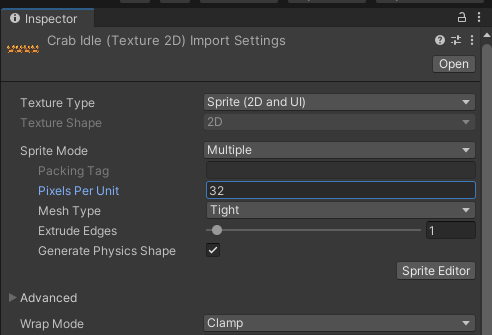
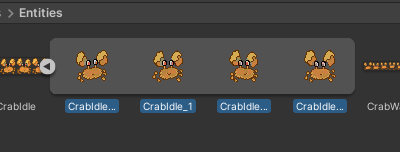
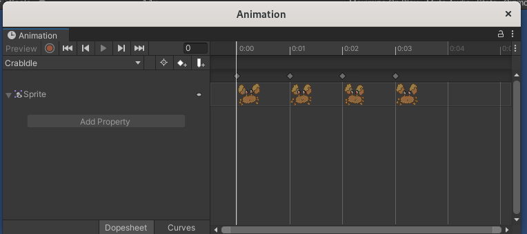

# Animations

## Import the textures

First, create a texture containing all your frames. Each frame must take the same place.  
  
Put it somewhere in your `Assets` folder, like `Assets/Graphics/Textures/*.png`.  

---

Select it within Unity, and in the inspector:  
- set **Sprite Mode** to "**Multiple**"
- set **Pixels per Unit** to the width of a frame (ex: 32px)
  

Now, open the "Sprite Editor".  

---

In the second menu:  
- set **Type** to **Grid By Cell Size**
- set the **Pixel Size** matching one frame size

  

---

Your texture file is now imported into multiple sprites.  

## Create the animations

In the project files within Unity, you can expand your texture; you should see every sprites created from earlier.  

  

Select all of them, and drag and drop them in a scene.  
It will ask you to save the animation. Give it a name matching the animation.  

---

Two files should have been created: the first one is the animation itself, and the second one is the animator controller we will use later.  

  

You can repeat the process for each one of your animations.  
However, we won't use an animator for every animations: you can delete all but one, and give it a name like "CharacterAnimator".  

---

You might want to edit your animation; you can double click on it.  
(if needed, expand the "Sprite" and zoom out the right side of the panel to see your frames)  

  

You can tweak the frames here.  

## Arrange into an animator

Now open the animator you kept.  
For each animation state you want, right click, **Create state**, **Empty**.  

  

Prepare all the states you want.  

---

In the **Parameters** tab, add every parameters you need to handle the animation.  
Click on the **+**, and add the type you need (can be float for some velocity, a trigger for a punctual change,...)  

  

---

Link your states together by right clicking on them, "Make Transition" and link to another.  

  

Plan all your state changes.  

---

For each arrow, you can configurate its behavior after clicking on it.  
- set the **Conditions** to move from one state to another
- check or uncheck **Has Exit Time** if you want an animation to be finished before transitioning or not (ex: a sword slash should probably have an exit time) 

  

---

Control your animator conditions from a monobehaviour attached to your prefab.  

  

