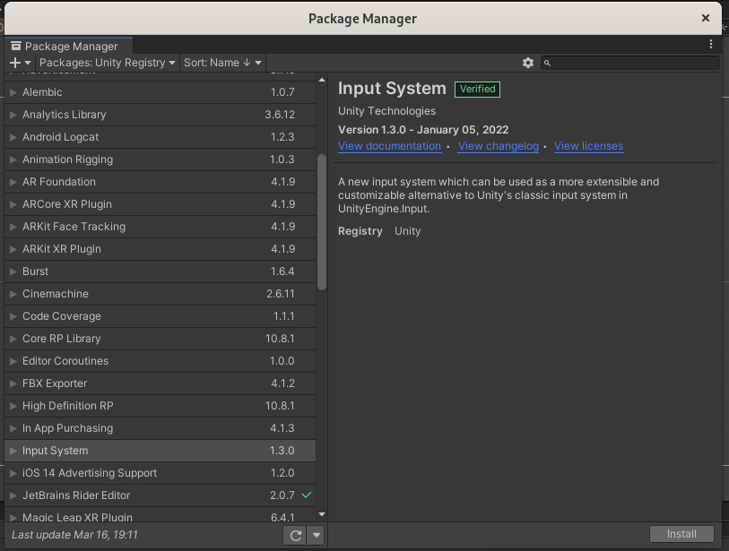
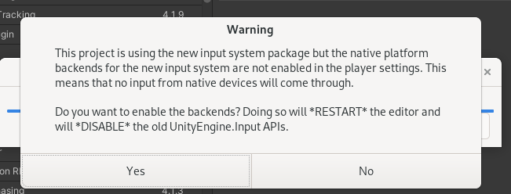
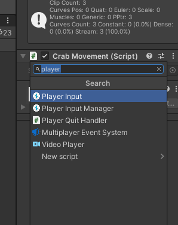
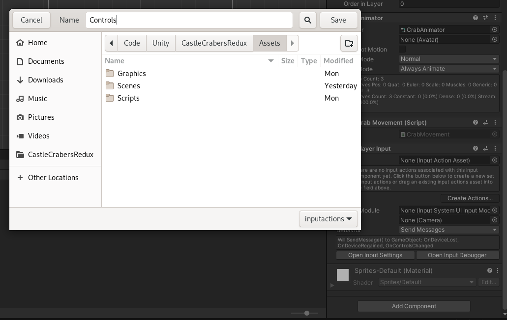
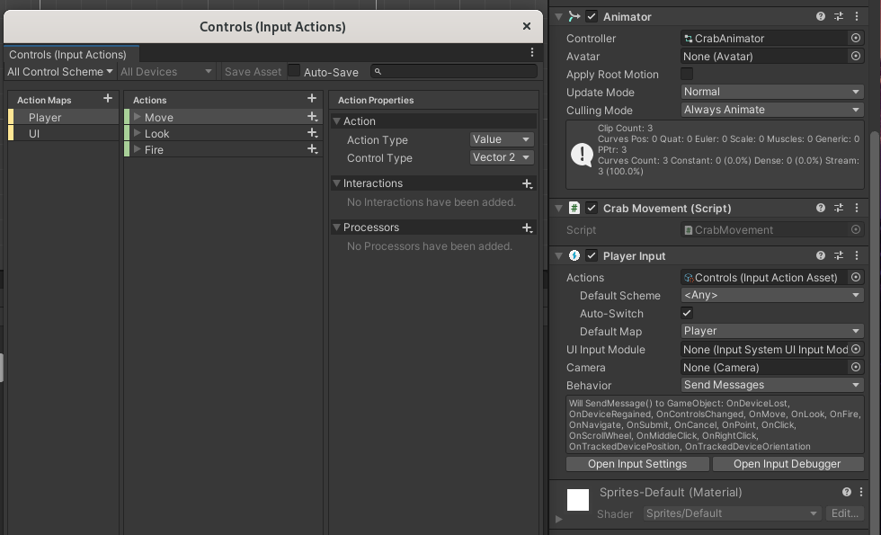
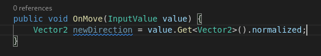

# Input

Implement controls using the new input system.  

## Enabling the new input system on project

Start by adding the new input system to your project, if not already done.  
Open the package manager in **Window** > **Package Manager**.  

Search in **Packages: Unity Registry**; choose **Input System**. Install it.  

Say yes to enable the backends and restart the editor. (This also disable old input system)  

## Adding controls to player

In your project, go to a gameobject where you wish to add controls, like your Player.  
In the inspector, add a component, and look for **Player Input**.  

In the new component, click on **Create Actions...** and save the file.  

It will contain all the controls for one player.  

---

Your player should now have a "*Input Action Asset*" attached (if not, bind it yourself). You can open it  

It already has some controls set up. This is where you should add new controls.  

---

Now within a MonoBehaviour attached to the same GameObject, you can implement a method named **OnMove**, or **OnYourAction** with any action you created in the previous window.  

It can take an `InputValue`; in this example, it will trigger each time the control has a change (press or release one of the arrow keys).  

> If your vscode doesn't recognize `InputValue` or anything from `InputSystem`, go in your **Preferences**, **External tools**, check *Generate .csproj files for: **- Embedded packages*** and **Regenerate project files**.   
