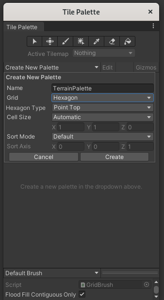
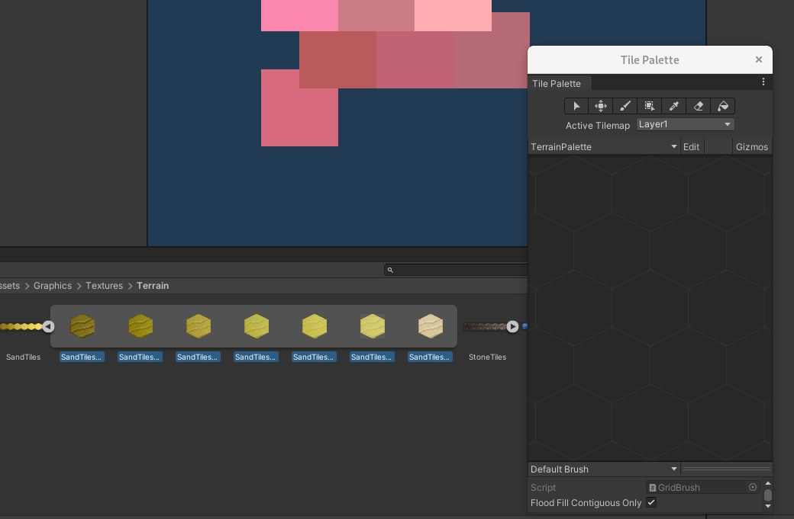
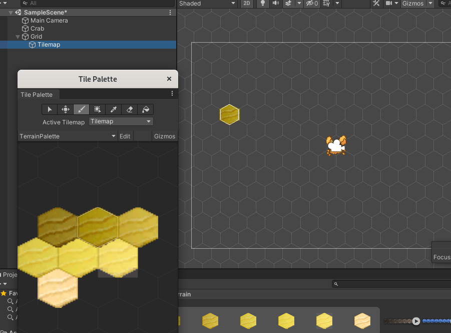
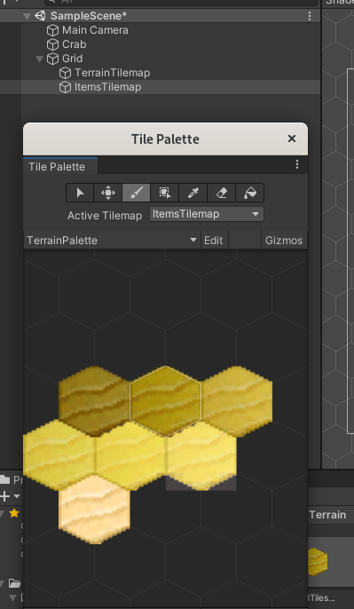
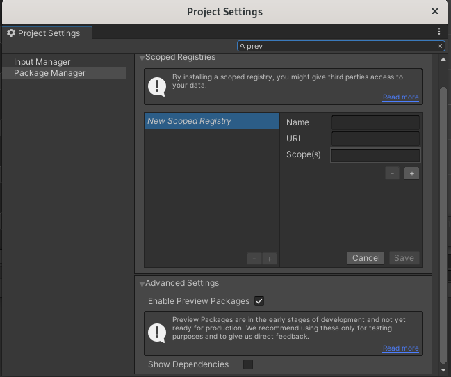
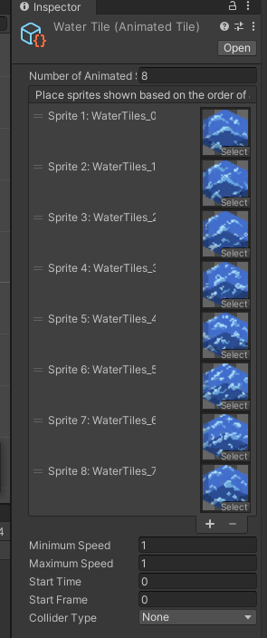

# Tilemap

## Creating a palette

First, get the textures you want to use somewhere in your  `Assets` folder.  
Open the palette panel from Unity toolbar, **Window**, **2D**, **Tile Palette**.  

  

Create a new palette with the grid type you want.  
Save it somewhere like `Assets/Graphics/Tiles/*Palette`.  

---

Select the textures you want to add to your palette, and drag and drop them in the palette panel.  

  

Save it somewhere like `Assets/Graphics/Tiles/*Tiles`  

---

Your palette is ready!  

## Creating a tilemap

In Unity, create a tilemap in a scene by right clicking, **2D Object**, **Tilemap**, and create the type you want.  

  

You're now able to fill your grid with tiles from your palette.  

---

If you want multiple layers of tiles (like to differentiate the ground from some props), create any tilemap you need *within the same grid*.  

  

You can now select which active tilemap you want to paint on in the palette.  

---

## Using animated tiles

If you need animated tiles, first in **Project Settings** check the **Enable Preview Packages** in **Package Manager** settings.  

  

Now install **2D Tilemap Extras** in the **Package Manager**.  

---

Now in Unity, right click in the project folder panel, **Create**, **2D**, **Tiles**, **Animated Tiles**.  

Open it, and add all your frames within it.  

  

Now you just need to add it to an existing palette, and use it.  
