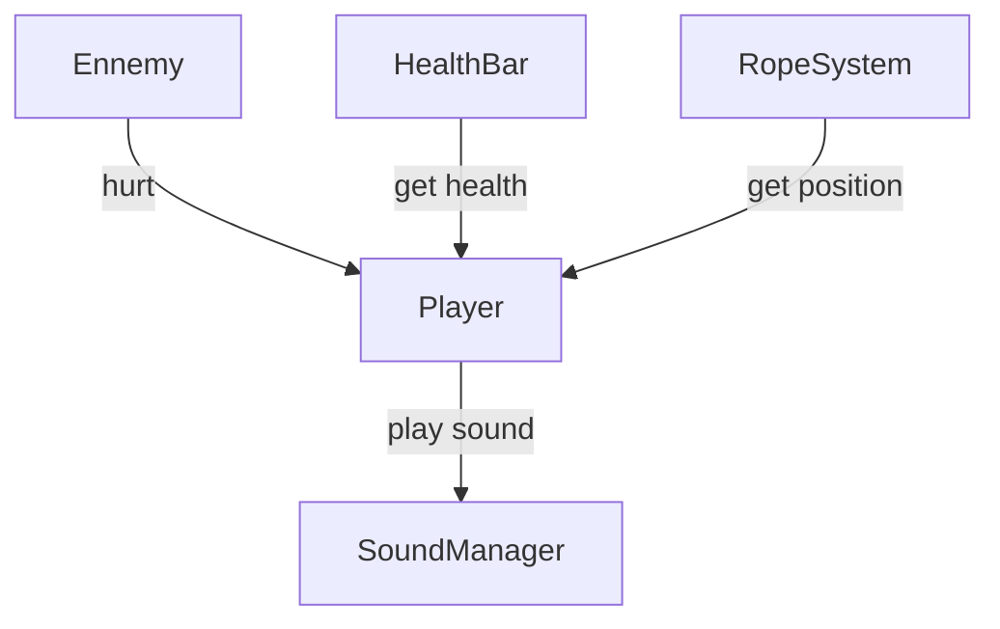
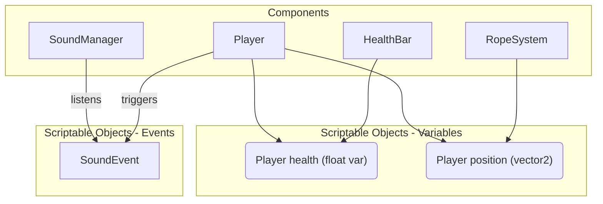

# Scriptable Objects architecture

By relying on scriptable objects as our way to interact between gameobjects, we could avoid many exceptions and develop a game more easily.    

---

## A shift in the architecture

On the games we currently create, every component/gameObject can interact with any other. Here is a small example inspired from LD49:  

Now, let's interact between components **only** through scriptable objects:  

Now we would not use methods like `FindGameObjectWithTag`, `FindGameObject` or `SerializeField` with components from other gameobjects:  
**A component cares only about his own gameobject and the scriptable objects it uses.**  

## Why should we try using it?

It makes our game modular, editable and debuggable.  
Here are 2 simple examples:  

* **Adding a feature won't break anyone's scene**

What happens if you add some `GameObject.FindGameObjectWithTag()` in a player script, and that someone does not have such object in his scene? It will probably break the whole script and make the game unplayable...  
Scriptable Objects are **stored outside the scene**, so you don't risk breaking other people's code by doing so.  

Prefabs work on their own, and systems are not directly dependent on each other.  

* **Change data easily when you want**

Our game is built around data, and we can manipulate it at runtime just by changing our scriptable objects.  
You don't even need to be a developper to be able to do so.  

## What does it mean in our project?

As a first step, we could rely a lot on scriptable objects of two kinds:  

- **Variables**  
*ex: player position, health, map data*  
They are simply scriptable objects wrapping variables, that we can edit by accessing "`.Value`".  
If a variable has to be edited by multiple components, it can be made into a scriptable object.  
*[Here is an example for a very simple float variable SO](./FloatVariable.cs)*

- **Event**
*ex: player death, next level, stun player*  
This allow communication between two different components. One submit an event, and another listen to it.  
*Here are the examples we can use from Ryan Hipple:*
  - [Game event](https://github.com/roboryantron/Unite2017/blob/master/Assets/Code/Events/GameEvent.cs)
  - [Game event listener](https://github.com/roboryantron/Unite2017/blob/master/Assets/Code/Events/GameEventListener.cs)

In our project, we could have this kind of file structure:
- Assets  
  - **GameData**
    - **Events**
      - `SpawnEnemy.asset`
      - `PlayerDeath.asset`
    - **Variables**
      - `PlayerHealth.asset`
      - `CursorPosition.asset`
  - **ScriptableObjects**
    - **Events**
      - `Event.cs`
    - **Variables**
      - `FloatVariable.cs`
      - `Vector2Variable.cs`
  - ...  

We might have what we need with only a few generic scriptable objects; to be tested.  

> Scriptable Objects do not necessarily need to be instantiated as files. You could create some at runtime.
