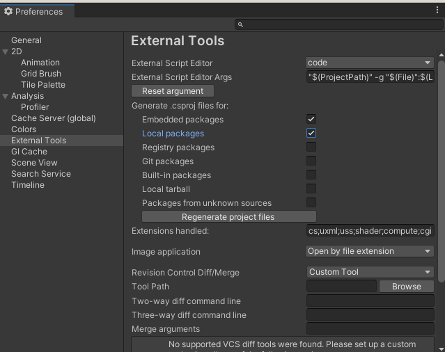

# Setting up your environment

## Setting up Git

This part is only relevant if we're using **Git**.  
If we rely on **Collab** to share our work, you'll only need Unity and a Unity account.   
If we use **Github**, you'll need to:  
- [Download git](https://git-scm.com/) and install it. You can easily find a GUI client if you do not wish to use command line  
- Set-up a [Github](https://github.com) account.
- [Configure a SSH key](https://docs.github.com/en/authentication/connecting-to-github-with-ssh/adding-a-new-ssh-key-to-your-github-account), to be authorized to pull the project and to push your changes
- Try to pull the project using SSH (if you use https, *you won't be able to push changes*)

## Unity

Now for the game engine and editor itself:  
- [Download the Unity Hub](https://unity.com/download) and install it
- In the hub, **Installs** tab, **Add** a new version of Unity and select the one we're using  
> We try to stay on the LTS versions unless we have a good reason not to
- Within the **Projects** tab, **Add** one and look for the folder you previously pulled from Github

## VScode

We usually work with VScode for our projects.  
- You can [get it here](https://code.visualstudio.com/) and install it
- You will need to install `dotnet`, `mono`, and the vscode extension `Unity Tools` ([source](https://code.visualstudio.com/docs/other/unity))
- Once installed, open your Unity project with VScode (**Assets > Open C# Project**)
- In Unity, go to **Edit > Preferences**, and in **External Tools**, check **Embedded packages** and **Local packages** before **Regenerate project files**  
  
*(Not entirely sure which ones we need tbh)*
